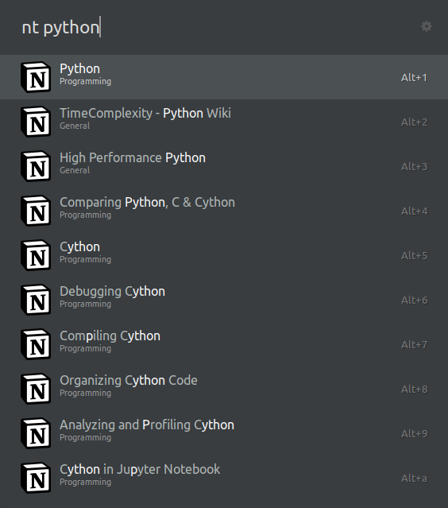

# ulauncher-notion-search

Search Notion pages using Ulauncher.

<p align="center">
  
</p>

## Install

### Requirements

- [Ulauncher 5](https://ulauncher.io/)
- Python >= 3.7
- Required Python packages:
  - `thefuzz[speedup]`: For fuzzy text matching
  - `aiohttp`: For async HTTP requests

  Install these using:
  ```bash
  sudo pip3 install thefuzz[speedup] aiohttp
  ```

### Steps

1. Ulauncher > Preferences > Extensions > Add extension

2. Paste the following URL:

    ```
    https://github.com/hakonmh/ulauncher-notion-search
    ```

3. Go to [Notion Integration](https://www.notion.so/my-integrations), create an integration and [follow the instructions](https://developers.notion.com/docs/getting-started#getting-started) to link the token with a page.

4. Allow a page to be searched by: Go to the page > `...` (top right corner) > Add connections > Add your Notion integration

    - You only need to do this for top level pages. The integration gets access to all child pages.

5. Copy the integration token into the *Notion Token* field in the Notion Search settings.

    - Multiple tokens can be specified by using `,` as a delimiter.

This extension should now be set up and work.

## Usage

Default keyword to trigger this extension is **`nt`**. This can be changed in the preferences.

## License

This source code is released under the [MIT](LICENSE) license.
